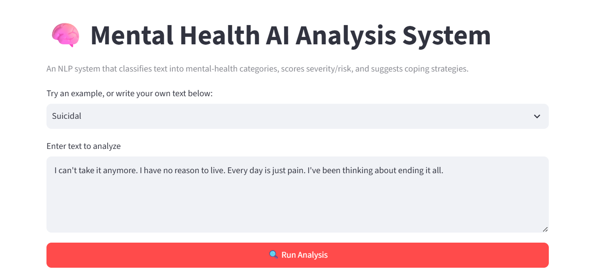
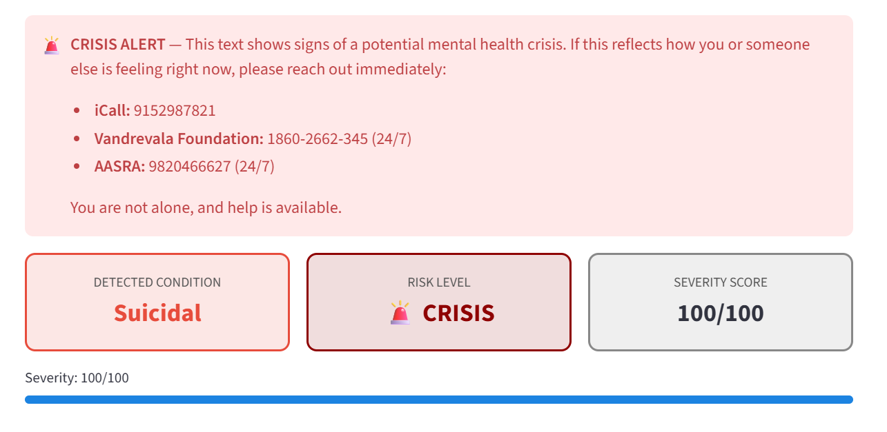

<div align="center">

# 🧠 Mental Health Detection System

<br/>

[](https://python.org)
[](#)
[](https://scikit-learn.org)
[](#)
[](https://kaggle.com)
[](#)
[](#)
[](#)

<br/>

> **52,681 real social media posts** · **7 mental health conditions** · **3 ML models compared** · **0–100 severity scoring** · **crisis detection** · **coping strategy engine**

</div>

---

## 🎥 Live Demo

🔗 **Try it live :** [Mental Health AI Analysis App](https://shinearushi525-mental-health-app-app-gozfkb.streamlit.app/)

---

## 📸 See It In Action

**Selecting an example and entering text:**


**Crisis detection, risk level, and severity scoring:**


---

## 🎯 The Problem

Mental health is one of the most underdiagnosed challenges of our generation.

<div align="center">

| 🔢 Statistic | 💡 Fact |
|-------------|---------|
| **1 in 4 people** | Experience a mental health issue every year |
| **Majority of cases** | Go undetected or untreated, especially early on |
| **800,000+** | Die by suicide annually worldwide (WHO) |
| **Leading cause** | Mental illness is a top cause of disability globally |

</div>

People often express real distress in writing — journals, messages, social posts — long before speaking to anyone. This project explores whether NLP can help surface those signals early, as a **decision-support and awareness tool**, not a replacement for professional care.

---

## ✨ What This System Does

| # | Feature | Description | Tech Used |
|---|---------|-------------|-----------|
| 1 | 🎯 **7-Class Classifier** | Identifies Normal, Depression, Anxiety, Suicidal, Bipolar, Stress, Personality Disorder | TF-IDF + Linear SVM |
| 2 | 📊 **Severity Scoring** | 0–100 risk score computed *after* prediction, from keywords + sentiment (not fed into the model — see note below) | Rule-based, post-hoc |
| 3 | 💬 **Dual Sentiment Engine** | VADER for social-media tone + TextBlob for polarity/subjectivity | NLTK VADER + TextBlob |
| 4 | ⚠️ **Trigger Word Detector** | Flags keywords across 4 categories: suicidal risk, depression signs, anxiety signs, crisis words | Rule-based NLP |
| 5 | 💊 **Coping Strategy Engine** | Suggests strategies tailored to the detected condition | Knowledge base |
| 6 | 🚨 **Crisis Alert System** | Flags high-risk text with real Indian crisis helplines | Threshold logic |
| 7 | 📈 **Confidence Breakdown** | Shows relative confidence across all 7 conditions | ML decision function |
| 8 | 🔮 **Full Analysis Pipeline** | One click → complete condition + severity + sentiment + strategy report | Integrated Streamlit app |

---

## 📊 Dataset

<div align="center">

| Property | Details |
|-------------|-----------|
| **Total Posts** | 52,681 real posts (after cleaning) |
| **Columns** | `statement` (text) · `status` (label) |
| **Categories** | 7: Normal, Depression, Suicidal, Anxiety, Bipolar, Stress, Personality disorder |

</div>

```
Mental Health Condition    Posts     Share
────────────────────────────────────────────
😊  Normal               16,351    31.0%
😔  Depression           15,404    29.2%
⚠️  Suicidal             10,653    20.2%
😰  Anxiety                3,888     7.3%
🔄  Bipolar                2,877     5.5%
😤  Stress                 2,669     5.1%
🧠  Personality Disorder   1,201     2.3%
────────────────────────────────────────────
    TOTAL                52,681   100.0%
```

---

## 🧪 Feature Engineering

| Feature Group | Details |
|---------------|---------|
| TF-IDF (uni + bigrams) | Up to 20,000 features, min_df=3, max_df=0.92 |
| VADER sentiment | compound, positive, negative, neutral |
| TextBlob | polarity, subjectivity |
| Text stats | character length, word count |

**Important note on methodology:** an early version of this pipeline also fed a "severity score" into the classifier as a training feature. That score was partly *derived from the true label*, which meant the model was indirectly seeing the answer during training — a classic data leakage bug. It inflated apparent accuracy substantially, while quietly failing on real, unseen text (since the label-derived feature isn't available at real inference time). This was caught and fixed: severity is now computed **after** prediction, from the model's own output, not fed in as an input. The metrics below reflect the corrected, honest pipeline.

---

## 🤖 Models Compared

| Model | Accuracy | Weighted F1 | Macro F1 |
|-------|----------|-------------|----------|
| 🔴 **Linear SVM (best)** | **73.4%** | **73.1%** | **69.8%** |
| 🔵 Naive Bayes | 68.7% | 68.4% | 61.2% |
| 🟢 Logistic Regression | 47.6% | 45.5% | 33.1% |

> Trained on an 80/20 stratified split of 52,681 posts. Class-balanced weighting applied where supported.

These numbers are realistic for a 7-class, imbalanced, informal-text classification problem — not inflated by feature leakage.

---

## 📊 Severity Score System — 5 Risk Tiers

```
Risk Tier    Score Range    Meaning                  Action
─────────────────────────────────────────────────────────────
🟢 LOW        0  –  20     No significant signals   Monitor
🟡 MILD       21 –  40     Mild distress signals    Acknowledge
🟠 MODERATE   41 –  60     Moderate concern         Recommend support
🔴 HIGH       61 –  80     High risk signals        Urgent support
🚨 CRISIS     81 – 100     Crisis-level signals     Immediate help
```

---

## 🗂️ Project Structure

```
📁 Mental-Health-Detection-system/
│
├── app.py                                # Streamlit app (live demo)
├── train_model.py                        # Training script
├── requirements.txt
├── model_info.json                       # Real evaluation metrics
├── mental_health_model.pkl               # Trained classifier
├── mental_health_tfidf.pkl               # TF-IDF vectorizer
├── mental_health_encoder.pkl             # Label encoder
├── screenshot-input.png
├── screenshot-result.png
│
├── notebooks/
│   └── Mental_Health.ipynb               # Original exploration notebook
│
├── data/
│   └── mental_health_combined.zip        # Dataset
│
└── README.md
```

---

## 💼 Real-World Applications

```
🏥  Healthcare Platforms     →  Early detection and patient triage
📱  Social Media Companies   →  Content moderation and user safety
🎓  Universities             →  Student mental wellness monitoring
💼  HR / Corporates          →  Employee burnout early-warning signal
🌐  NGOs / Helplines         →  Screening support at scale
```

---

## 🧰 Tech Stack

| Category | Tools |
|----------|-------|
| **Language** | Python 3.10+ |
| **Data** | Pandas, NumPy, SciPy |
| **NLP** | NLTK (VADER, lemmatization, stopwords), TextBlob, TF-IDF |
| **ML** | Scikit-learn (Naive Bayes, Logistic Regression, Linear SVM) |
| **App** | Streamlit |
| **Deployment** | Streamlit Community Cloud |


---

## 👨‍💻 Author

<div align="center">

**Arushi Garg**

*B.Tech Computer Science (AI and Data Science)*

[](https://www.linkedin.com/in/arushi-garg525/)
[](https://github.com/Shinearushi525)
[](mailto:Arushigarg525@gmail.com)

</div>
